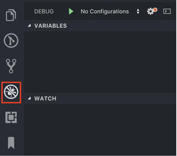
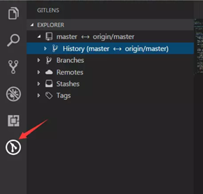

# vscode 插件介绍以及配置

配置时 vscode 的版本(Help->About 查看版本)

```text
Version: 1.46.1 (user setup)
Commit: cd9ea6488829f560dc949a8b2fb789f3cdc05f5d
Date: 2020-06-17T21:13:20.174Z
Electron: 7.3.1
Chrome: 78.0.3904.130
Node.js: 12.8.1
V8: 7.8.279.23-electron.0
OS: Windows_NT x64 10.0.18362
```

## 总览

- Quokka.js
- Markdown Paste
- Code Spell Checker
- Prettier
- Rainbow Brackets
- 汉化插件
- CSS Modules
- CSS Peek
- Turbo Console Log
- Debugger for Chrome
- Markdown All in One
- Auto Rename Tag
- open in browser
- path intellisense
- ES7 React/Redux/React-Native/JS snippets
- vscode-icons
- GitLens

## 1. Quokka.js

Quokka 是一个调试工具，可以为您正在编写的代码提供实时反馈。它能够预览变量的函数和计算值结果。该扩展易于配置，对于使用 JSX 或 TypeScript 的项目可直接使用。

- 使用:
  - 安装 Quokka.js
  - shift+ctrl+P -> 搜索 quokka.js -> new js/ts file
  - 将代码复制到新得文件中,输入想要查看的变量,后边就会显示值
    

## 2. Markdown Paste

将图片复制之后可以将图片粘贴到`.md` 文件中,可以修改图片名字以及路径

- 使用:
  - 安装 Markdown Paste
  - 'Ctrl+Alt+V' ('Cmd+Alt+V' on Mac) 将图片粘贴到.md 文件中
  - 改变路径: 设置->搜索 Markdown Paste
    

## 3. Code Spell Checker

它是一款拼写检查程序，可以为开发者报告一些常见的拼写错误。它很适合驼峰式代码。


在代码中禁用/启用检查(可以使用注释设置)

It is possible to disable / enable the spell checker by adding comments to your code.

- 停用检查
  ```js
  /* cSpell:disable */
  /* spell-checker: disable */
  /* spellchecker: disable */
  /* cspell: disable-line */
  /* cspell: disable-next-line */
  ```
- 开启检查
  ```js
  /* cSpell:enable */
  /* spell-checker: enable */
  /* spellchecker: enable */
  ```
- 例子

```js
// Nest disable / enable is not Supported

// spell-checker:disable
// It is now disabled.

var liep = 1;

/_ cspell:disable _/;
// It is still disabled

// cSpell:enable
// It is now enabled

const str = 'goededag'; // <- will be flagged as an error.

// spell-checker:enable <- doesn't do anything

// cSPELL:DISABLE <-- also works.

// if there isn't an enable, spelling is disabled till the end of the file.
const str = 'goedemorgen'; // <- will NOT be flagged as an error.
```

- 忽略

  你可以在文档里指定某些忽略检查的 words。

  ```js
  // cSpell:ignore zaallano, wooorrdd
  // cSpell:ignore zzooommmmmmmm
  const wackyWord = ['zaallano', 'wooorrdd', 'zzooommmmmmmm'];
  ```

  你可以创建某些自定义的短语，它也可以作为替代的建议选项。

  ```js
  // cSpell:words woorxs sweeetbeat
  const companyName = 'woorxs sweeetbeat';
  ```

## 4.Prettier

是一个严格基于规则的代码格式化程序。


eslint 也可以通过指定--fix 参数来格式化，为什么还需要 prettier？
eslint 只能进行部分格式化，但这个格式化只是用来修正规范性，对代码可读性并没有改变，对于像 var a={a:1,b:2,}这样写在一行的代码，并不能格式化。

使用:

- alt + shift + f

配置:

- 项目根目录添加`.prettierrc`文件

```js
{
//需要去掉注释
"singleQuote": true,
//使用单引号
"trailingComma": "es5",
//在对象或数组最后一个元素后面是否加逗号（在ES5中加尾逗号）
"tabWidth": 2,
//tab宽度2个空格
"useTabs": false,
//使用tab缩进
"semi": true,
//句尾添加分号
"arrowParens": "always",
//只有一个参数的箭头函数的参数是否带圆括号
"bracketSpacing": true,
// 对象中的空格 默认true
"eslintIntegration":true,
//开启支持eslint
//jsxBracketSameLine": false,
// 在jsx中把'>' 是否单独放一行
//"jsxSingleQuote": false,
// 在jsx中使用单引号代替双引号
//"parser"
//指定哪种解析器。
}
```


- 添加 eslint-config-prettier 与 eslint-plugin-prettier 两个包后，再配合两者一起使用。
  - eslint-plugin-prettier
    
  - eslint-config-prettier
    

## 5. Rainbow Brackets


安装即可

## 6.汉化插件


- 使用方法:
  安装后，在 locale.json 中添加 "locale": "zh-cn"，即可载入中文（简体）语言包。要修改 locale.json，你可以同时按下 Ctrl+Shift+P 打开命令面板，之后输入 "config" 筛选可用命令列表，最后选择配置语言命令。

## 7.CSS Modules

对使用了 css modules 的 jsx 标签的类名补全和跳转到定义位置, **只能用于 react 项目**


## 8. CSS Peek

快速查看定位 CSS 定义非常的方便


- 使用: ctlr+右击 className
  

## 9. Turbo Console Log


- 使用:
  - 选中变量
  - Pressing ctrl + alt + L
  - 取消所有:Pressing shift + alt + d
    

## 10.Debugger for Chrome

- 在 Chrome 中运行代码，使用 vscode 进行调试。
- 首先你得知道怎么在 vscode 里调试代码。直接在 vscode 的插件管理里安装 Debugger for Chrome。这样在.vscode/lanch.json 里就可以添加"type": "chrome"类型的调试配置了。。
  - 1.点击侧边栏的调试图标，或者直接使用 cmd + shift + d 快捷键，打开调试页面。
    
  - 2.在调试页面点击添加配置(Add configuragion), Chrome Debugger 会生成一个.vscode/launch.json。可以在这个文件中添加调试启动参数。比如我的项目中的配置如下（每次运行调试都会打开一个新的 Chrome 进程）
    
  - 3.Chrome Debugger 需要知道你的代码保存在哪里，所以我们需要配置 webRoot 项，除非你在 webpack 的配置中做了特别处理(比如 context: path.resolve(\_\_dirname, 'somePath')或 devServer:{contentBase: 'somePath'})，否则配置为项目根目录(\${workspaceFolder})就可以了。
  - 4.先启动 webpack-dev-server，再点击调试页的绿色三角就可以启动调试了
  - 5.如果在 vscode 中设置断点时出现如下错误(Error processing "setBreakpoints": Error: Could not resolve breakpoint) 检查你的 webpack 配置，需要配置 devtool: 'source-map'，关于 devtool 的配置可以查看 devtool
    

## 11. Markdown All in One

## 12. Auto Rename Tag

## 13. open in browser

## 14. path intellisense

## 15. ES7 React/Redux/React-Native/JS snippets

## 16. vscode-icons

## 17.GitLens

- git 多人协作的时候需要查看日志，如果能在当前代码中查看到那是很方便的一件事，能省去很多时间去其他工具查看，提高工作效率。
- VsCode 中的 GitLens 插件刚好能满足这个需求，而且搭配 Cmder 使用，很舒服，不会出现换行不工整的问题，还可以设置自己喜欢的主题
- 每一行代码旁边都有日志，哪位同学写的都逃不掉。
  
- 还可以很方便的操作查看上下 push 记录
  
- 可以查看全部的日志，在 VsCode 左侧菜单栏，点击 GitLens 图标即可查看 History
  
